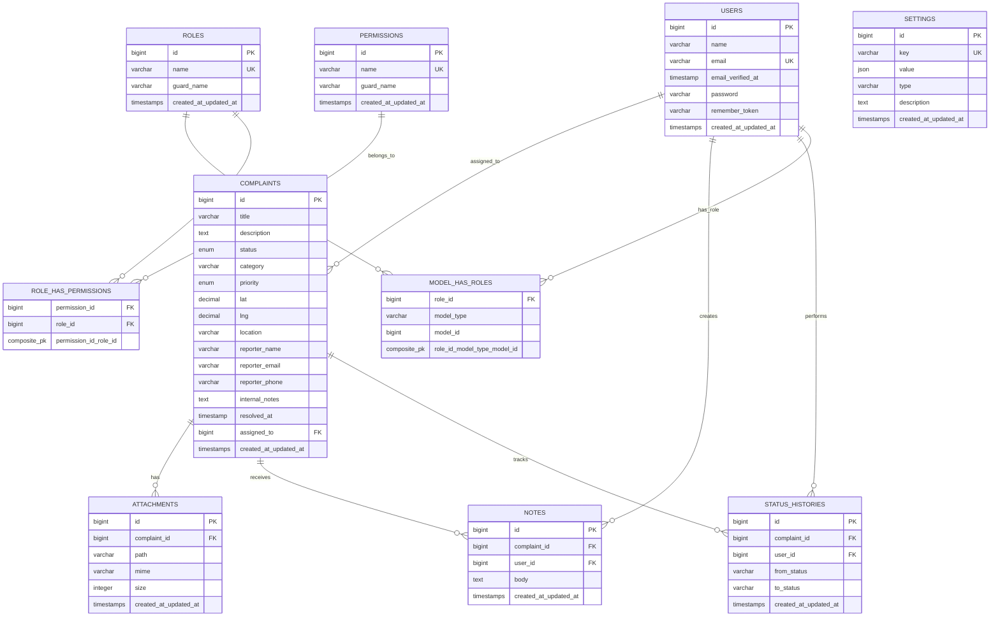

# 🗂️ GEMEENTE KLACHTEN SYSTEEM - ENTITY RELATIONSHIP DIAGRAM (ERD)

**Datum:** 29 september 2025  
**Project:** Gemeente Klachtenportaal  
**Team:** Groep van 2-4 studenten  

## 📊 DATABASE OVERZICHT

### Hoofdentiteiten
Het systeem bestaat uit de volgende hoofdentiteiten en hun onderlinge relaties:



## 🔗 RELATIE DETAILS

### 1. Users ↔ Complaints
- **Relatie:** One-to-Many (1:N)
- **Type:** `assigned_to` (optionele toewijzing)
- **Constraint:** `FOREIGN KEY assigned_to REFERENCES users(id)`
- **Cascade:** `ON DELETE SET NULL`

### 2. Complaints ↔ Attachments  
- **Relatie:** One-to-Many (1:N)
- **Type:** Compositie (een klacht kan meerdere bestanden hebben)
- **Constraint:** `FOREIGN KEY complaint_id REFERENCES complaints(id)`
- **Cascade:** `ON DELETE CASCADE`

### 3. Complaints ↔ Notes
- **Relatie:** One-to-Many (1:N)  
- **Type:** Compositie (een klacht kan meerdere notities hebben)
- **Constraint:** `FOREIGN KEY complaint_id REFERENCES complaints(id)`
- **Cascade:** `ON DELETE CASCADE`

### 4. Users ↔ Notes
- **Relatie:** One-to-Many (1:N)
- **Type:** Aggregatie (een gebruiker kan meerdere notities schrijven)
- **Constraint:** `FOREIGN KEY user_id REFERENCES users(id)`
- **Cascade:** `ON DELETE CASCADE`

### 5. Complaints ↔ Status Histories
- **Relatie:** One-to-Many (1:N)
- **Type:** Compositie (audit trail van statuswijzigingen)
- **Constraint:** `FOREIGN KEY complaint_id REFERENCES complaints(id)`
- **Cascade:** `ON DELETE CASCADE`

### 6. Users ↔ Status Histories  
- **Relatie:** One-to-Many (1:N)
- **Type:** Aggregatie (wie de statuswijziging heeft uitgevoerd)
- **Constraint:** `FOREIGN KEY user_id REFERENCES users(id)`
- **Cascade:** `ON DELETE SET NULL`

## 🔐 SPATIE PERMISSION SYSTEEM

### Role-Based Access Control (RBAC)
Het systeem gebruikt het Spatie Permission package voor role-based toegangscontrole:

#### Users ↔ Roles (Many-to-Many)
- **Tabel:** `model_has_roles`
- **Polymorphic:** Ja (`model_type` = 'App\Models\User')
- **Constraint:** Composite primary key

#### Roles ↔ Permissions (Many-to-Many)  
- **Tabel:** `role_has_permissions`
- **Direct:** role_id ↔ permission_id
- **Constraint:** Composite primary key

## 📋 DOMEIN WAARDEN

### Complaint Status (ENUM)
```sql
status IN ('open', 'in_behandeling', 'opgelost')
```

### Priority Levels (ENUM)  
```sql
priority IN ('low', 'medium', 'high', 'urgent')
```

### File Types (Attachments)
- **Images:** JPEG, PNG, GIF
- **Documents:** PDF
- **Max Size:** 10MB per bestand
- **Max Count:** 5 bestanden per klacht

## 🎯 INDEXING STRATEGIE

### Primary Keys
- Alle tabellen hebben `bigint AUTO_INCREMENT` primary keys

### Foreign Keys  
- Alle foreign key relaties hebben indexes voor performance
- Cascade regels gedefinieerd voor data integriteit

### Unique Constraints
- `users.email` - Uniek email adres
- `settings.key` - Unieke configuratie sleutels
- `roles.name + guard_name` - Unieke rol namen per guard
- `permissions.name + guard_name` - Unieke permissie namen per guard

## 💾 DATA TYPES

### Spatial Data
- **Latitude:** `DECIMAL(10,8)` - Precisie tot ~1 meter
- **Longitude:** `DECIMAL(11,8)` - Precisie tot ~1 meter

### Text Fields
- **Korte teksten:** `VARCHAR(255)` (titels, namen)
- **Lange teksten:** `TEXT` (beschrijvingen, notities)  
- **JSON Data:** `JSON` (settings values)

### Timestamps
- **Laravel Timestamps:** `created_at`, `updated_at` 
- **Custom Timestamps:** `resolved_at`, `email_verified_at`

## 🔒 BEVEILIGING & PRIVACY

### Data Minimalisatie (GDPR)
- Alleen noodzakelijke persoonsgegevens opgeslagen
- `internal_notes` voor gevoelige informatie
- Automatische data retentie na configureerbare periode

### Cascade Gedrag
- **CASCADE:** Attachments, Notes, Status Histories (onderdeel van complaint)
- **SET NULL:** User referenties (behoud data, anonimiseer relatie)

---

**📝 Opmerking:** Dit ERD toont de huidige productie database structuur van het gemeente klachten systeem zoals geïmplementeerd in Laravel 12 met SQLite als development database.
