# Gemeente Klachtensysteem - Use Case Diagram

## 📋 Overzicht

Dit document beschrijft de functionaliteiten van het Gemeente Klachtensysteem vanuit gebruikersperspectief. Het use case diagram toont de verschillende actoren (gebruikers) en hun interacties met het systeem.

## 🎯 Doel

Het use case diagram helpt bij:
- **Functioneel begrip**: Wat kan het systeem doen?
- **Gebruikersrollen**: Wie kan wat doen?
- **Feature scope**: Welke functionaliteiten zijn beschikbaar?
- **Requirements mapping**: Koppeling tussen behoeften en functionaliteit
- **Testing basis**: Foundation voor test scenario's

## 👥 Actoren

### 1. **Burger** (Publieke Gebruiker)
- Niet ingelogde bezoeker van de gemeente website
- Kan klachten indienen zonder account
- Heeft beperkte toegang tot openbare informatie

### 2. **Geregistreerde Gebruiker**
- Ingelogde burger met eigen account
- Kan eigen klachten bekijken en beheren
- Heeft toegang tot persoonlijk dashboard

### 3. **Medewerker**
- Gemeente medewerker met beperkte admin rechten
- Kan klachten bekijken en bewerken
- Kan notities toevoegen en status wijzigen

### 4. **Admin**
- Volledige toegang tot het systeem
- Kan gebruikers beheren
- Heeft toegang tot alle admin functies

### 5. **Systeem** (External Actor)
- Automatische processen
- Scheduled tasks en background jobs
- Email notificaties

## 🎭 Use Case Diagram

```mermaid
flowchart TD
    %% === ACTOREN ===
    Burger([👤 Burger])
    GeregistreerdeGebruiker([👤 Geregistreerde<br/>Gebruiker])
    Medewerker([👨‍💼 Medewerker])
    Admin([👨‍💻 Admin])
    Systeem([🤖 Systeem])

    %% === PUBLIEKE USE CASES ===
    subgraph PubliekeServices [" 🌐 Publieke Services "]
        UC1[Gemeente Website Bezoeken]
        UC2[Klacht Indienen]
        UC3[Bestand Uploaden]
        UC4[Chatbot Raadplegen]
        UC5[FAQ Bekijken]
        UC6[Contact Informatie Bekijken]
    end

    %% === AUTHENTICATIE USE CASES ===
    subgraph AuthServices [" 🔐 Authenticatie Services "]
        UC7[Account Registreren]
        UC8[Inloggen]
        UC9[Uitloggen]
        UC10[Wachtwoord Resetten]
        UC11[Email Verificatie]
        UC12[Profiel Beheren]
    end

    %% === GEBRUIKER USE CASES ===
    subgraph GebruikerServices [" 👤 Gebruiker Services "]
        UC13[Dashboard Bekijken]
        UC14[Eigen Klachten Bekijken]
        UC15[Klacht Status Volgen]
        UC16[Meldingen Ontvangen]
    end

    %% === MEDEWERKER USE CASES ===
    subgraph MedewerkerServices [" 👨‍💼 Medewerker Services "]
        UC17[Admin Dashboard Bekijken]
        UC18[Alle Klachten Bekijken]
        UC19[Klacht Details Bekijken]
        UC20[Klacht Status Wijzigen]
        UC21[Notities Toevoegen]
        UC22[Klachten Kaart Bekijken]
        UC23[Klachten Zoeken/Filteren]
    end

    %% === ADMIN USE CASES ===
    subgraph AdminServices [" 👨‍💻 Admin Services "]
        UC24[Gebruikers Beheren]
        UC25[Rollen Toewijzen]
        UC26[Database Bekijken]
        UC27[Systeeminstellingen Beheren]
        UC28[Klachten Verwijderen]
        UC29[Privacy Logs Bekijken]
        UC30[Systeem Status Controleren]
    end

    %% === SYSTEEM USE CASES ===
    subgraph SysteemServices [" 🤖 Automatische Processen "]
        UC31[Email Notificaties Versturen]
        UC32[Oude Klachten Opschonen]
        UC33[Privacy Logs Genereren]
        UC34[Backup Maken]
        UC35[Performance Monitoring]
        UC36[Security Scanning]
    end

    %% === CHATBOT USE CASES ===
    subgraph ChatbotServices [" 🤖 Chatbot Services "]
        UC37[Chatbot Gesprek Starten]
        UC38[Vragen Beantwoorden]
        UC39[Klachten Zoeken]
        UC40[Door Verwijzen naar Medewerker]
    end

    %% === ACTOR RELATIONSHIPS ===
    
    %% Burger → Publieke Services
    Burger --> UC1
    Burger --> UC2
    Burger --> UC3
    Burger --> UC4
    Burger --> UC5
    Burger --> UC6
    Burger --> UC7
    Burger --> UC8

    %% Burger → Chatbot
    Burger --> UC37
    Burger --> UC38

    %% Geregistreerde Gebruiker (inherits from Burger)
    GeregistreerdeGebruiker --> UC1
    GeregistreerdeGebruiker --> UC2
    GeregistreerdeGebruiker --> UC3
    GeregistreerdeGebruiker --> UC4
    GeregistreerdeGebruiker --> UC5
    GeregistreerdeGebruiker --> UC6
    GeregistreerdeGebruiker --> UC9
    GeregistreerdeGebruiker --> UC10
    GeregistreerdeGebruiker --> UC11
    GeregistreerdeGebruiker --> UC12
    GeregistreerdeGebruiker --> UC13
    GeregistreerdeGebruiker --> UC14
    GeregistreerdeGebruiker --> UC15
    GeregistreerdeGebruiker --> UC16
    GeregistreerdeGebruiker --> UC37
    GeregistreerdeGebruiker --> UC38

    %% Medewerker (inherits from Geregistreerde Gebruiker)
    Medewerker --> UC13
    Medewerker --> UC14
    Medewerker --> UC15
    Medewerker --> UC16
    Medewerker --> UC17
    Medewerker --> UC18
    Medewerker --> UC19
    Medewerker --> UC20
    Medewerker --> UC21
    Medewerker --> UC22
    Medewerker --> UC23
    Medewerker --> UC39
    Medewerker --> UC40

    %% Admin (inherits from Medewerker)
    Admin --> UC17
    Admin --> UC18
    Admin --> UC19
    Admin --> UC20
    Admin --> UC21
    Admin --> UC22
    Admin --> UC23
    Admin --> UC24
    Admin --> UC25
    Admin --> UC26
    Admin --> UC27
    Admin --> UC28
    Admin --> UC29
    Admin --> UC30
    Admin --> UC39
    Admin --> UC40

    %% Systeem → Automatische Processen
    Systeem --> UC31
    Systeem --> UC32
    Systeem --> UC33
    Systeem --> UC34
    Systeem --> UC35
    Systeem --> UC36

    %% === INCLUDE/EXTEND RELATIONSHIPS ===
    
    UC2 -.->|includes| UC3
    UC4 -.->|extends| UC37
    UC8 -.->|includes| UC11
    UC13 -.->|includes| UC8
    UC17 -.->|includes| UC8
    UC20 -.->|includes| UC33
    UC28 -.->|includes| UC33
    UC40 -.->|extends| UC38

    %% === STYLING ===
    classDef actor fill:#e1f5fe,stroke:#0277bd,stroke-width:2px
    classDef usecase fill:#f3e5f5,stroke:#7b1fa2,stroke-width:1px
    classDef system fill:#fff3e0,stroke:#ef6c00,stroke-width:1px
    classDef chatbot fill:#e8f5e8,stroke:#388e3c,stroke-width:1px

    class Burger,GeregistreerdeGebruiker,Medewerker,Admin actor
    class Systeem system
```

## 🔄 Use Case Details

### 📱 Publieke Use Cases

#### UC1: Gemeente Website Bezoeken
- **Doel**: Toegang tot gemeente informatie en services
- **Actor**: Burger
- **Scenario**: Bezoeker navigeert naar gemeente website en bekijkt informatie

#### UC2: Klacht Indienen
- **Doel**: Melding maken van gemeente gerelateerde problemen
- **Actor**: Burger
- **Scenario**: 
  1. Gebruiker opent klacht formulier
  2. Vult vereiste informatie in
  3. Upload optioneel bestanden
  4. Verstuurt klacht
  5. Ontvangt bevestiging
- **Includes**: UC3 (Bestand Uploaden)

#### UC3: Bestand Uploaden
- **Doel**: Toevoegen van ondersteunende documenten/foto's
- **Actor**: Burger
- **Scenario**: Selecteer bestand, valideer formaat/grootte, upload

### 🔐 Authenticatie Use Cases

#### UC7: Account Registreren
- **Doel**: Nieuwe gebruikersaccount aanmaken
- **Actor**: Burger
- **Scenario**: Email, naam, wachtwoord invoeren en account activeren

#### UC8: Inloggen
- **Doel**: Toegang verkrijgen tot persoonlijke functies
- **Actor**: Geregistreerde Gebruiker, Medewerker, Admin
- **Scenario**: Credentials invoeren, sessie starten
- **Includes**: UC11 (Email Verificatie)

### 👤 Gebruiker Use Cases

#### UC13: Dashboard Bekijken
- **Doel**: Overzicht van persoonlijke gegevens en activiteiten
- **Actor**: Geregistreerde Gebruiker
- **Precondities**: Ingelogd zijn
- **Includes**: UC8 (Inloggen)

#### UC14: Eigen Klachten Bekijken
- **Doel**: Status en details van ingediende klachten controleren
- **Actor**: Geregistreerde Gebruiker
- **Scenario**: Lijst met eigen klachten en details per klacht

### 👨‍💼 Medewerker Use Cases

#### UC17: Admin Dashboard Bekijken
- **Doel**: Overzicht van alle systeem activiteiten
- **Actor**: Medewerker, Admin
- **Scenario**: Statistieken, recente klachten, systeem status

#### UC20: Klacht Status Wijzigen
- **Doel**: Voortgang van klachtbehandeling bijwerken
- **Actor**: Medewerker, Admin
- **Scenario**: Status selecteren, reden invoeren, wijziging opslaan
- **Includes**: UC33 (Privacy Logs Genereren)

#### UC21: Notities Toevoegen
- **Doel**: Interne opmerkingen bij klachten documenteren
- **Actor**: Medewerker, Admin
- **Scenario**: Notitie tekst invoeren en opslaan

### 👨‍💻 Admin Use Cases

#### UC24: Gebruikers Beheren
- **Doel**: Gebruikersaccounts en rechten beheren
- **Actor**: Admin
- **Scenario**: Gebruikers zoeken, rollen toewijzen, accounts deactiveren

#### UC26: Database Bekijken
- **Doel**: Direct inzicht in database tabellen en records
- **Actor**: Admin
- **Scenario**: Tabellen selecteren, data bekijken, filters toepassen

#### UC28: Klachten Verwijderen
- **Doel**: Ongepaste of vervallen klachten verwijderen
- **Actor**: Admin
- **Scenario**: Klacht selecteren, reden opgeven, bevestigen
- **Includes**: UC33 (Privacy Logs Genereren)

### 🤖 Systeem Use Cases

#### UC31: Email Notificaties Versturen
- **Doel**: Automatische communicatie met gebruikers
- **Actor**: Systeem
- **Triggers**: Status wijzigingen, nieuwe klachten, system events

#### UC32: Oude Klachten Opschonen
- **Doel**: AVG compliance door data retentie
- **Actor**: Systeem
- **Scenario**: Scheduled job verwijdert klachten ouder dan retentieperiode

#### UC33: Privacy Logs Genereren
- **Doel**: Audit trail voor privacy compliance
- **Actor**: Systeem
- **Triggers**: Alle acties die persoonlijke data raken

### 🤖 Chatbot Use Cases

#### UC37: Chatbot Gesprek Starten
- **Doel**: Interactieve hulp bij vragen en problemen
- **Actor**: Burger, Geregistreerde Gebruiker
- **Scenario**: Widget openen, begroeting ontvangen, gesprek starten

#### UC38: Vragen Beantwoorden
- **Doel**: Automatische antwoorden op veelgestelde vragen
- **Actor**: Burger, Geregistreerde Gebruiker
- **Scenario**: Vraag stellen, AI antwoord ontvangen

#### UC39: Klachten Zoeken
- **Doel**: Bestaande klachten opzoeken via chatbot
- **Actor**: Medewerker, Admin
- **Scenario**: Zoekterm invoeren, resultaten ontvangen

#### UC40: Door Verwijzen naar Medewerker
- **Doel**: Escalatie naar menselijke hulp
- **Actor**: Medewerker, Admin
- **Extends**: UC38 (als automatisch antwoord niet voldoet)

## 🔗 Use Case Relaties

### Include Relaties
- **UC2 includes UC3**: Klacht indienen kan bestand uploaden bevatten
- **UC8 includes UC11**: Inloggen vereist email verificatie check
- **UC13 includes UC8**: Dashboard toegang vereist inloggen
- **UC20 includes UC33**: Status wijziging genereert privacy log
- **UC28 includes UC33**: Klacht verwijdering genereert privacy log

### Extend Relaties
- **UC4 extends UC37**: FAQ bekijken kan leiden tot chatbot gesprek
- **UC40 extends UC38**: Complexe vragen escaleren naar medewerker

### Inheritance (Generalization)
- **Geregistreerde Gebruiker** erft alle Burger use cases
- **Medewerker** erft alle Geregistreerde Gebruiker use cases
- **Admin** erft alle Medewerker use cases

## 📊 Use Case Prioriteiten

### **Hoge Prioriteit** (Core Functionaliteit)
- UC2: Klacht Indienen
- UC8: Inloggen
- UC17: Admin Dashboard
- UC18: Alle Klachten Bekijken
- UC20: Klacht Status Wijzigen

### **Gemiddelde Prioriteit** (Belangrijke Features)
- UC13: Dashboard Bekijken
- UC14: Eigen Klachten Bekijken
- UC21: Notities Toevoegen
- UC24: Gebruikers Beheren
- UC32: Oude Klachten Opschonen

### **Lage Prioriteit** (Nice-to-Have)
- UC4: Chatbot Raadplegen
- UC22: Klachten Kaart Bekijken
- UC26: Database Bekijken
- UC37-40: Chatbot Use Cases

## 🎯 Success Criteria

### Functionaliteit
- ✅ Alle high-priority use cases zijn geïmplementeerd
- ✅ Gebruikers kunnen succesvol klachten indienen
- ✅ Medewerkers kunnen klachten effectief beheren
- ✅ Admin heeft volledige controle over het systeem

### Gebruiksbaarheid
- ✅ Intuïtieve user interface voor alle actoren
- ✅ Duidelijke feedback bij alle acties
- ✅ Responsive design voor mobile gebruikers

### Security & Privacy
- ✅ Secure authenticatie en autorisatie
- ✅ Privacy compliance (AVG)
- ✅ Audit trails voor alle kritieke acties

---

*Dit use case diagram reflecteert de huidige functionaliteiten van het Gemeente Klachtensysteem en wordt bijgewerkt bij feature wijzigingen.*
